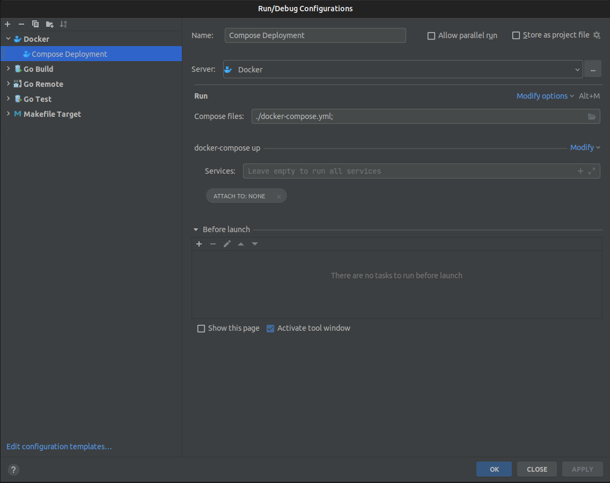
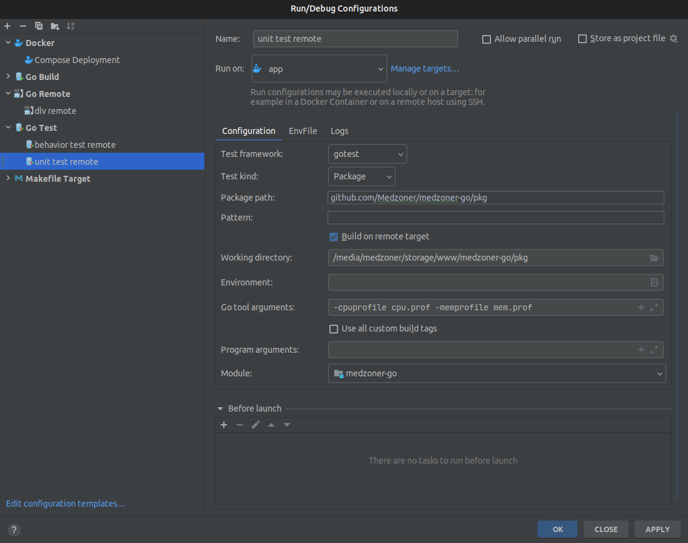
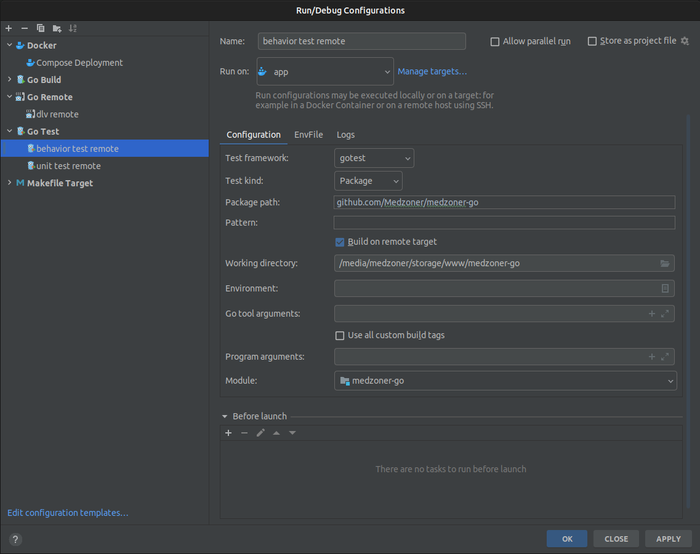

<p align="center">
  
  <h3 align="center">medzoner.com</h3>
  <p align="center">Source</p>
</p>

---
# Badges
[](https://github.com/medzoner/medzoner-go/actions/workflows/github-actions.yml/badge.svg?branch=master)
[](https://coveralls.io/github/Medzoner/medzoner-go?branch=master)
[](LICENSE)
[](https://goreportcard.com/report/github.com/Medzoner/medzoner-go?service=github)

# Short Description
My website https://www.medzoner.com rewrite in golang from php (https://github.com/Medzoner/medzoner.com)

## Configuration

Configuration can be specified in .env or exported as environment variable:

| Name  | Value |
| ------------- | ------------- |
| ENV  | string  |
| DEBUG  | bool  |
| OPTIONS  | []string{} (option1,option2....)  |
| DATABASE_DSN  | string (ex: root:changeme@tcp(database:3366))  |
| DATABASE_NAME  | string  |
| DATABASE_DRIVER  | string  |
| MAILER_USER  | string  |
| MAILER_PASSWORD  | string  |

## Build
```
go build -o bin/app ./cmd/app/main.go
go build -o bin/migrate ./cmd/migrate.go
```

## Run
```
go run ./cmd/app/main.go
go run ./cmd/migrate.go
```


## Debug
```
go install github.com/go-delve/delve/cmd/dlv@master
dlv debug --headless --listen=:4000 --only-same-user=false --api-version=2 --accept-multiclient --log --log-output=rpc ./cmd/app/main.go
```


## Test

### UnitTest
```
go test -v -cover -coverpkg=./... ./pkg/...
```


### BehaviorTest
Database (mysql) must be up and configured before run.
```
go test godog_test.go
```


## Developed & Maintained by
[Mehdi Youb](https://github.com/Medzoner) 

## License 
[](LICENSE)
